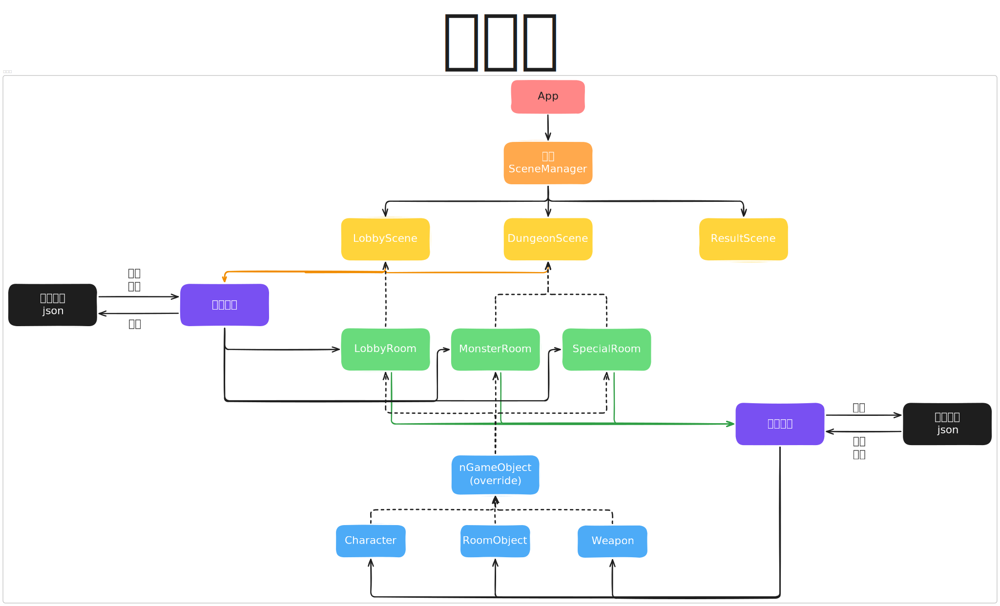
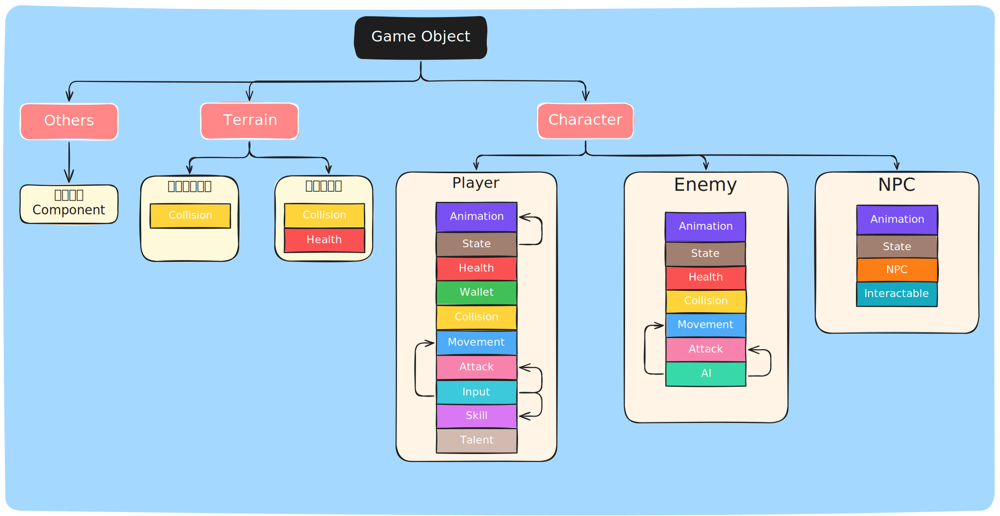

# 2025 OOPL Final Report

## 組別資訊

**組別：** 第 39 組
**組員：**

- 112590035 葉凱成
- 112590042 鄭錦鑫

**復刻遊戲：** 元氣騎士（Soul Knight）

---

## 專案簡介

### 遊戲簡介

本專案旨在還原經典地牢射擊遊戲《元氣騎士》初代版本的核心玩法體驗，採用 PTSD 遊戲框架與 C++ 實作。玩家在隨機生成的地牢中，操作角色進行移動、射擊、閃避，並與各式敵人戰鬥，收集武器與道具，挑戰關卡 Boss。本專案實現了一個大關卡，含五個隨機小關卡（冰原主題），並支援商店、寶箱房、NPC 互動等基本玩法元素。

### 組別分工

| 組員   | 分工內容                                                                             |
| ------ | ------------------------------------------------------------------------------------ |
| 葉凱成 | 場景系統設計與管理、大關卡流程控制、碰撞系統、可互動物件系統、隨機關卡生成、遊戲音效 |
| 鄭錦鑫 | 角色與敵人類別設計、AI 行為、武器系統、天賦與道具系統、動畫與特效製作、存檔系統      |

---

## 遊戲介紹

### 遊戲規則

- 玩家可在大廳進入遊戲關卡
- 每通過一個小關卡會隨機生成下一關房間
- 角色可使用武器射擊敵人，收集掉落的能量與金幣
- 玩家可在特殊房間內與 NPC 互動，購買物品
- **視野與自動瞄準機制：**
  - 遊戲實作了**視野判定規則**，當敵人與玩家之間沒有障礙物遮蔽時，系統會：
    - **自動鎖定最近的可見敵人** 作為攻擊目標（優先最近 + 無遮蔽）
    - 透過 **Raycasting 判定視線遮蔽**，避免穿牆鎖定
  - 大多數敵人具備基本的 AI 感知與攻擊邏輯：
    - **偵測玩家位置** 並嘗試靠近追擊
    - 若進入攻擊範圍且**與玩家無遮蔽**，則發動攻擊
- 打敗大 Boss（雪人王）即通關
- 遊戲結束條件：通關/死亡
- **按鍵操作：** 可以看遊戲畫面前半段或是設定中教學

### 遊戲畫面

**手機版：**

---

## 程式設計

### 程式架構

本專案採用 PTSD 架構設計，實現了以下模組：

- **App / SceneManager：** 管理場景切換、遊戲主循環
- **Scene：** 不同的遊戲場景（主選單、大廳、關卡等）
- **MapGenerator：** 小關卡隨機生成模組
- **各種 Manager：** 負責處理各種事件或是物件的管理
- **nGameObject：** 所有遊戲物件的基底類別
- **Character / Enemy / NPC：** 繼承 GameObject 的具體角色
- **Weapon / Bullet：** 武器與子彈類別實作
- **各種 Component：** 遊戲物件的組成

詳細可查看：[遊戲運行邏輯/架構](https://excalidraw.com/#room=14f2a41e39a4bd1c4af2,OME25KsrfJQcoMUMvtZfhg) ~~（建議看這邊的）~~

### 程式技術

- 類別繼承與元件組合化設計
  - 參考了 ECS（Entity-Component-System）
  - 由於實力有限，只做到了 Component-based Design
- **管理員/監聽者模式**
  - 大量設計思路參考了[Refactoring.Guru](https://refactoringguru.cn/)整理的設計模式
- 使用 **JSON 格式**管理怪物與武器數值
  - 使用了 nlohmann 的 json 讀取庫
  - 也基於這方式實現了**存檔系統**
- **碰撞 Collision/觸發器 Trigger**邏輯
  - 基於 **AABB** 的碰撞檢測（Bounding Box）
  - 想實現圓形等其他圖形，但是~~失敗~~了 :)
- 實作**狀態機(FSM)** 架構
  - 場景切換
  - 簡易敵人 AI 狀態機（移動 + 攻擊）

---

## 結語

### 問題與解決方法

| 問題                                          | 解決方法                                             |
|---------------------------------------------|--------------------------------------------------|
| Tiled 地圖無法正確與角色同步鏡頭                         | 理解 PTSD 框架並抽象出鏡頭類別                               |
| 撞擊時角色圖片邊緣誤判                                 | 自定義碰撞箱大小， 增加容許誤差                                 |
| 怪物資料繁多難以維護                                  | 外部使用 JSON 管理數值，程式內讀取初始化                          |
| JSON路徑不統一                                   | 抽象Loader類別專門管理讀取路徑方法                             |
| 多場景切換資料遺失                                   | 利用 **單例Singleton** 管理全局資源（如玩家狀態）                 |
| 遊戲畫面卡頓問題1                                   | 使用資源池管理器ImagePool，避免同一張圖片、文字~~或動畫~~被重複載入，減少記憶體消耗 |
| 遊戲畫面卡頓問題2                                   | 對碰撞箱優化，將牆壁連續且多個碰撞箱進行合併，降低碰撞管理員的陣列的n              |
| 遊戲畫面卡頓問題3                                   | 對物件的更新時間優化，將個體物件的更新統一到鏡頭內根據鏡頭範圍來更新               |
| 未進入房間可以使用**殺死當前房間敵人功能(Debug模式)**，導致敵人產生異常行為 | **尚未解決**                                         |
| 為了效能，以房間為單位分割成成多個碰撞管理員，導致子彈在通道會穿過另一個房間的牆壁   | **尚未解決**，在不影響實際遊玩體驗的前提下的取捨                           |

### 自評

本專案成功完成了一個具備隨機地牢、基本戰鬥、物件互動的射擊遊戲，基本實現了原遊戲的主要機制。我們熟悉了遊戲架構設計的基本流程，並實作了多模組協作與資料結構管理的能力。雖然部分進階功能（如多人聯機）尚未完成，還有一些不影響遊戲進度的小 bug，但整體表現已達成預期。~~盡力了~~

| 項次 | 項目                                     | 完成 |
| ---- | ---------------------------------------- | ---- |
| 1    | 這是範例                                 | ✅   |
| 2    | 完成專案權限改為 public                  | ✅   |
| 3    | 具有 debug mode 的功能                   | ✅   |
| 4    | 解決專案上所有 Memory Leak 的問題        | ✅   |
| 5    | 報告中沒有任何錯字，以及沒有任何一項遺漏 | ✅   |
| 6    | 報告至少保持基本的美感，人類可讀         | ✅   |

### 心得

本專案為我們首次從零開始（雖然有助教提供的 PTSD 架構）建立一個完整的遊戲系統，過程中經歷了大量的除錯（coding 5 分鐘，debug 2 小時）、資料整理與邏輯設計，也磨合了彼此的合作方式，~~雖然一直看不懂對方寫的程式邏輯，痛苦面具~~。  
我們也學會了如何規劃開發時程(大概吧-_-)、如何將大型系統拆解成小模組、如何管理資源與文件。尤其在處理碰撞邏輯與場景切換上，我們學到了許多實務技巧，這對未來無論是遊戲開發或大型軟體專案都有極大幫助。

### 貢獻比例

| 組員  | 貢獻比重 | 說明                      |
| --- | ---- | ----------------------- |
| 葉凱成 | 50%  | 遊戲場景設計、隨機關卡生成、碰撞系統等(詳細看分工)   |
| 鄭錦鑫 | 50%  | 角色與敵人架構、AI 行為邏輯、武器與天賦系統等(詳細看分工) |

---
